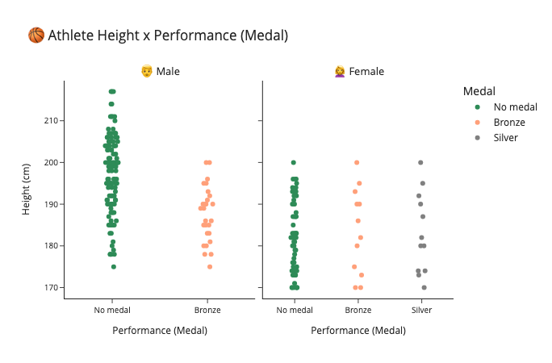

# Data Visualization - Brazil on the Olympic Games

*Exploratory Data Visual Analysis on Brazil at the Olympic Games*

## 📖 Project

### 👨🏻‍🏫 Introduction

A **visual** exploratory data analysis of 🇧🇷 Brazil at the Olympic Games on the [athlete_events.csv](#-features) dataset and some of the most popular data visualization libraries on python.

### 🎯 Goal

Practice data visualization skills. The notebook explores a few questions:

- Is there any correlation between an athlete's height and his/her performance for any sports?
- Do you think taller Basketball Brazil Teams perform better than the smaller? What about footbal? What would be a good Volleyball Team average height?
- What would be a good visualization to show, by sport, the proportion of gold, silver, and bronze medals Brazil have earned?
- How was Brazil's evolution in earned medals through time?

### 📊 Chart Example

## 🗄 Notebooks

- [1.0-eda.ipynb](https://nbviewer.org/github/ewerthonk/dataviz-olympics/blob/main/dataviz-olympics.ipynb)

**Important:** The notebook uses Plotly (check the hovers!) to create the charts. So, they will not be rendered directly on Github view. The link above redirects you to nbviewer.

## 📈 Features

| Column | Description                                     |
|--------|-------------------------------------------------|
| ID     | Athlete unique key.                             |
| Name   | Athlete name                                    |
| Sex    | Athlete gender (M or F)                         |
| Age    | Athlete age                                     |  
| Height | Athlete height (cm)                             |
| Weight | Athlete Weight (kg)                             |
| Team   | Team name                                       |
| NOC    | National Olympic Committee (3 letter code)      |
| Games  | Year and Season of Olympic Games                |
| Year   | Year of Olympic Games                           |
| Season | Season of Olympic Games (summer or winter)      |
| City   | Hosting city of Olympic Games                   |
| Sport  | Sport in which athlete competed                 |
| Event  | Sport category/event in which athlete competed  |
| Medal  | Earned medal: Gold, Silver, Bronze ou NaN       |

## 📦 Folder Structure

    ├── LICENSE
    ├── README.md          <- The top-level README for developers using this project.
    ├── data
    │   └── raw            <- The original, immutable data dump.
    │
    ├── notebooks          <- Jupyter notebooks. Naming convention is a number (for ordering),
    │                         and a short `-` delimited description, e.g.
    │                         `1.0--creating-the-model.ipynb`.
    ├── references         <- images, reports, and other resources for the project